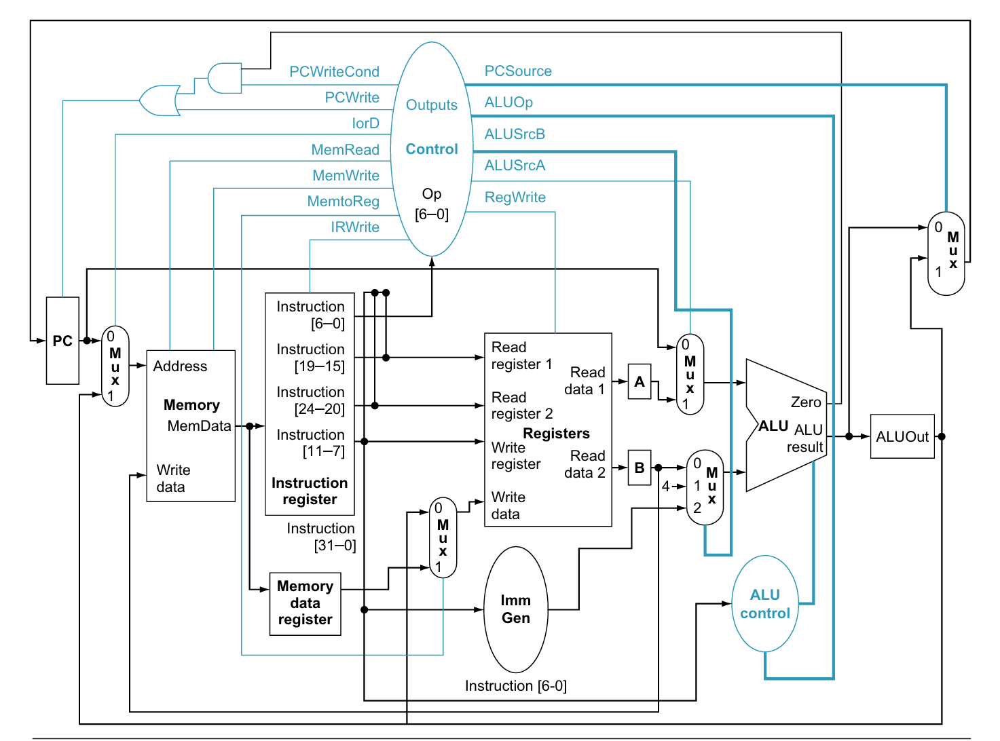
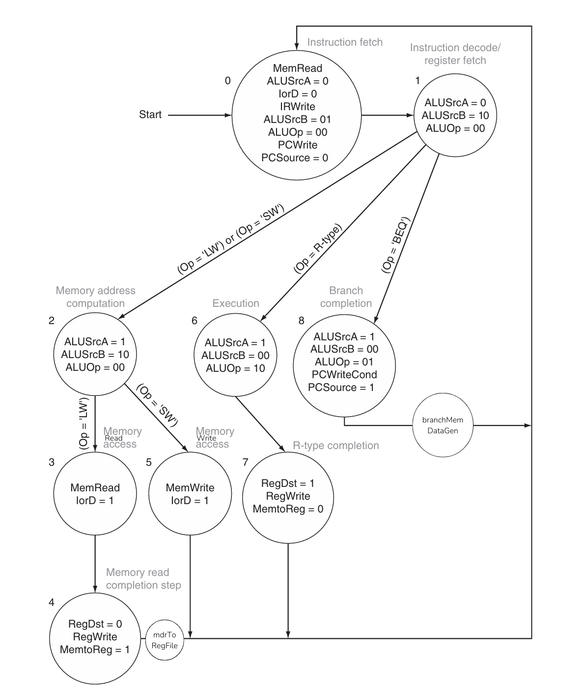

The repository contains verilog code for a RISC-V CPU that implements following instructions.

1. load word (lw)
2. add
3. branch if equal (beq)

top.v contains the top module (named top) of the design and test bench top_tb.v instantiates the module for a very basic test. Along with defining top module, the file also contains definition for 2 input mux, 3 input mux, register with enable and register without enable. I tried to implement the code on a small FPGA called tang nano, so you may see some code related to that but most of it is commented to make the code work on free verilog compiler 'icarus verilog'. 

Following are details of other files included in top.v.
1. <strong>alu.v</strong> 🧮- defines arithmetic logic unit of the processor.
2. <strong>rf.v</strong> 📁- defines register file, it contains all the 32-bit registers of the processor.
3. <strong>immGen.v</strong> - defines immediate generation unit.
4. <strong>control.v</strong> 👮‍♂️- defines the controller unit.
5. <strong>basicMemory.v</strong> - defines a basic memory array.

I wrote this code as I read through <strong>'Computer Organization and Design' by Patterson and Hennessy</strong>. Following image taken from the book shows the datapath of the implementation.

control.v contains code for the state machine implemented to control the design, Following image shows the state machine. Again the image is taken from the book but I have added few states to make my code work. You won't find the exact signal name as seen in the image but you will find signals with similar names.

